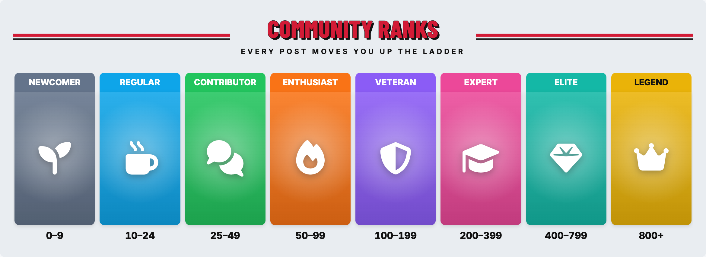
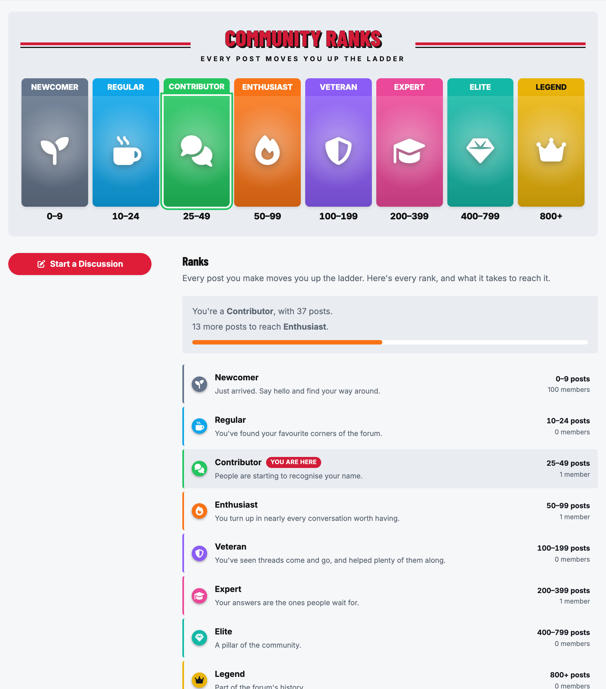
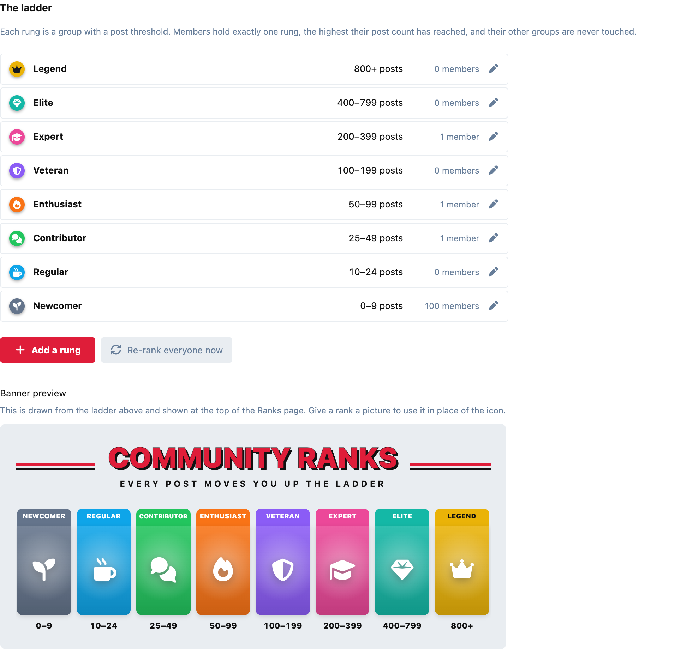
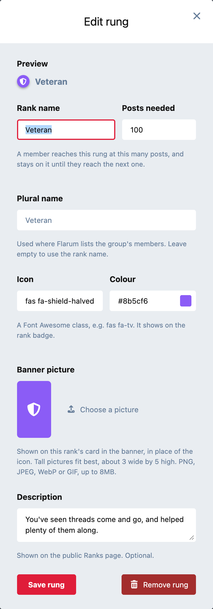
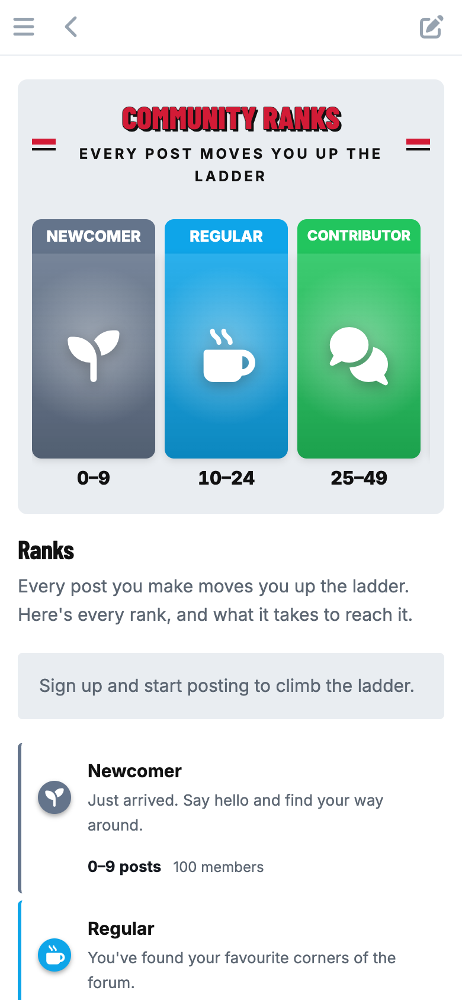

# Ladder

**Post-count ranks for Flarum 2. Members climb a ladder of groups and hold exactly one rung at a time.**

Set up a ladder of ranks, each with a name, icon, colour and post threshold.
As members post, they move up: on reaching 10 posts they leave *Rebobinando*
and join *Teleadicto*, and at 25 they leave that for *Recreativo*. Each rank is
an ordinary Flarum group, so the badge shows anywhere Flarum shows a group,
and a member's other groups (Admin, Mod, anything you assigned by hand) are
never touched.

[](https://flarum.org)
[](LICENSE)
[](https://www.php.net)



---

## What you get

- **Exclusive ranks.** A member holds one rung group at a time: the highest
  one their post count has reached. This is the difference from badge-style
  extensions, where every level reached stays attached and a long-time member
  ends up wearing all of them.
- **One-screen setup.** Add a rung and Ladder creates its group for you, with
  name, icon, colour and threshold together, and a live preview of the badge.
  You can also turn a group you already have into a rung.
- **No permission chores.** Rank groups need no permissions at all, since every
  member already has the Member group's. If you *do* want a rank to unlock
  something, grant it once on that rank and every rank above inherits it. See
  [Permissions](#permissions).
- **Applied straight away.** Any change to the ladder re-ranks the whole forum
  in the background of the admin page, with a progress bar. There's no "saved
  but not applied" state.
- **A ranks banner, made for you.** Your whole ladder as one poster: a card
  per rank in its colour, with its icon and post range, under a title and
  tagline. It's drawn from the ladder, so it updates the moment you change a
  rank. Give a rank a picture and it fills that rank's card instead of the
  icon. It sits at the top of the Ranks page, and optionally in your home
  page's hero.
- **A public Ranks page** at `/ranks`, built from the ladder itself, so it can't
  go out of date. Signed-in members see their rank and how many posts it takes
  to reach the next one.
- **A notification** when a member reaches a new rank. Members can switch it off
  in their notification settings like any other.
- **Works on any host.** Rank changes happen as the post is saved, with no queue
  worker or cron needed. Re-ranking runs from the browser in small slices, so
  it fits inside a shared host's time limits too.



| Admin | Editing a rung | On a phone |
|---|---|---|
|  |  |  |

---

## Installation

```bash
composer require ernestdefoe/ladder
php flarum migrate
php flarum cache:clear
```

Enable **Ladder** in the admin panel, then add your rungs.

### Updating

```bash
composer update ernestdefoe/ladder
php flarum migrate
php flarum cache:clear
```

---

## Setting up a ladder

1. Open **Admin → Ladder** and click **Add a rung**.
2. Give it a name, the number of posts that reaches it, an icon (a Font
   Awesome class such as `fas fa-tv`) and a colour. A description is optional
   and shows on the Ranks page.
3. Save. Ladder creates the group and re-ranks every member.

Start with a rung at **0 posts** so every member has a rank from the day they
join. New members are placed on it when they register.

The list sorts itself by threshold, since a rung's place on the ladder *is* its
post count.

### Removing a rung

- A rung whose group **Ladder created** is removed together with its group,
  and its members move down to the rung below.
- A rung made from a group **you already had** only stops being a rung. The
  group and its members stay exactly as they are.

---

## The ranks banner

The banner is built from your ladder, with no image to make or keep up to
date. Each rank is a card with its name in a bar of its colour, its icon
glowing on that colour, and the posts it takes underneath.

- **Title and tagline:** set under **Banner title** and **Banner tagline**.
  Leave the title empty to use your forum's name.
- **Pictures:** edit a rank and choose a **Banner picture** to show artwork on
  its card instead of the icon. Tall pictures fit best, about 3 wide by 5
  high. Uploads are resized and converted to WebP for you.
- **Where it shows:** always at the top of the Ranks page. Turn on **Also show
  the banner on the home page** to put it in the home page's hero, under the
  welcome message.
- **Long ladders:** every rank fits on one row on a desktop screen. Names
  shrink to fit their card, and on a phone the row scrolls sideways a card at
  a time.

---

## How ranking works

- The count is the member's **comment count**, the same number Flarum shows on
  their profile. Posts held for approval count from the moment they're
  approved.
- A member is re-ranked when they post, when one of their posts is deleted, and
  when a held post of theirs is approved.
- **No demotion by default.** Once a rank is reached it's kept, even if posts
  are deleted or points taken away later. Deleting a thread or pruning spam
  shouldn't strip a rank someone earned in public. Turn on **Move members down
  when they fall below their rank** for a strict ranking.
- **Exempt groups.** Members of any group you list under **Groups that never get
  a rank** are kept off the ladder entirely. Useful for bots and staff accounts.

---

## Ranking by points instead of posts

If you run [Leaderboard](https://discuss.flarum.org/d/38834) or
[FoF Gamification](https://github.com/FriendsOfFlarum/gamification), the ladder
page offers **Rank members by**: Posts, Leaderboard points or Gamification
points. Pick one and everyone is re-ranked straight away; the thresholds stay
as they are, so check they still make sense.

- **Leaderboard points** count everything Leaderboard scores: posts, likes,
  reactions, best answers, daily logins and the rest. Leaderboard doesn't
  announce when points change, so a member's rank is checked whenever they use
  the forum, at most every two minutes. Points earned while they're away, like
  likes on their posts, show up on their next visit, still with no cron job.
- **Gamification points** are the votes a member's posts have received. FoF
  Gamification announces every change, so ranks move the moment a vote is cast.
- Members see "points" everywhere the page would otherwise say "posts".
- If the extension you chose is turned off, Ladder goes back to counting posts
  rather than treating everyone as having 0 points.

---

## Permissions

Ranks are **exclusive for display and cumulative for permissions.**

Most ladders need no permissions at all: every confirmed member already has
the Member group's permissions, so a rank group can be just a badge.

If you want a rank to unlock something, such as uploads at *Recreativo*, grant
that permission to *Recreativo* only. With **Higher ranks keep the permissions
of lower ones** switched on (the default), members on *Radio*, *Leyenda* and
every rank above also have it, while still wearing just their own badge. You
never have to tick the same permission on every rung.

Switch it off if you want each rank's permissions to apply to that rank alone.

---

## Re-ranking from a terminal

The admin page re-ranks from the browser. For a large forum, or a scheduled
fix-up, there's a console command:

```bash
php flarum ladder:sync
```

It puts every member on the rung they have earned and reports how many changed.
It sends no notifications. Neither does a re-rank from the admin page, so
switching Ladder on for an established forum doesn't send every member an
alert at once.

---

## Requirements

- Flarum 2.0
- PHP 8.3 or newer

## Translations

Every string is in `locale/en.yml`. Copy it to your language's code to
translate.

## Licence

MIT. See [LICENSE](LICENSE).
